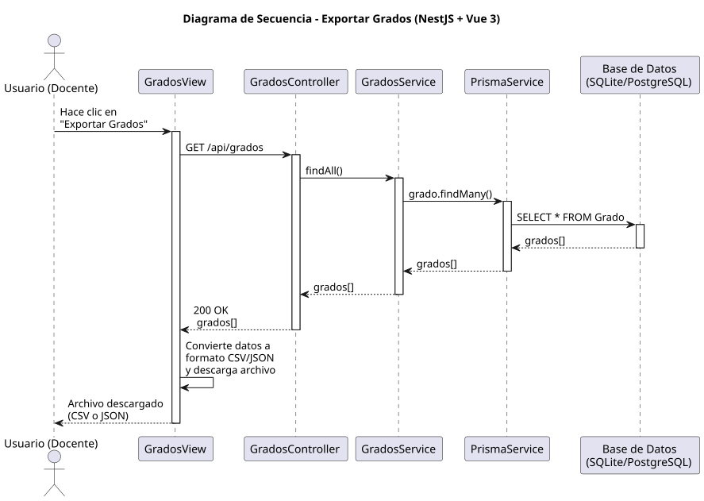

# 25-26-idsw2-sdVC > exportarGrados > Diseño

## Información del artefacto

| Campo | Valor |
|-------|-------|
| **Proyecto** | Sistema de Gestión de Exámenes Universitarios |
| **Fase RUP** | Elaboración |
| **Disciplina** | Diseño |
| **Versión** | 1.0 (NestJS + Vue 3) |
| **Fecha** | 2026-06-09 |
| **Autor** | Marcos Gutierrez |

## Propósito

Exportar todos los grados a un archivo descargable (CSV/JSON) reutilizando el endpoint GET /api/grados.

## Diagrama de secuencia de diseño

||
|-|
|Código fuente: [secuencia.puml](../../../modelosUML/diseño/exportarGrados/secuencia.puml)|

## Participantes

| Componente | Responsabilidad |
|---|---|
| **GradosView** | Botón de exportar y descarga del archivo. |
| **GradosController** | GET /api/grados (reutilizado). |
| **GradosService** | findAll() sin cambios. |
| **PrismaService** | Capa ORM. |
| **Base de Datos** | Almacena grados. |

## Decisiones de diseño

| Decisión | Justificación |
|---|---|
| **Reutiliza GET existente** | Sin endpoint específico; vista descarga datos recibidos. |
| **Conversión en frontend** | El listado ya está disponible en la vista. |
| **Sin vista separada** | Caso abstracto; es un botón en el listado. |
