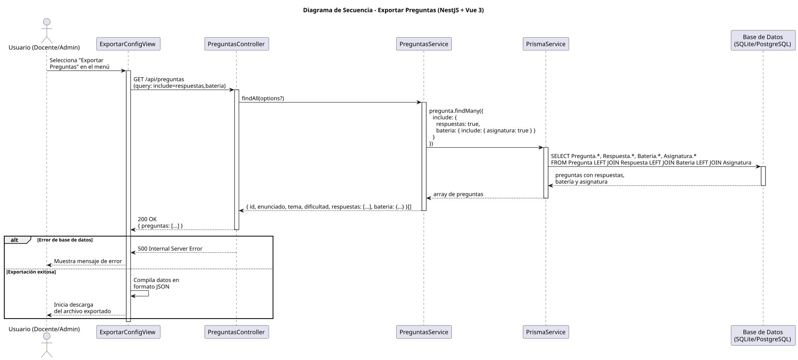

# 25-26-idsw2-sdVC > exportarPreguntas > Diseño

## Información del artefacto

| Campo | Valor |
|-------|-------|
| **Proyecto** | Sistema de Gestión de Exámenes Universitarios |
| **Fase RUP** | Elaboración |
| **Disciplina** | Diseño |
| **Versión** | 1.0 (NestJS + Vue 3) |
| **Fecha** | 2026-06-09 |
| **Autor** | Marcos Gutierrez |

## Propósito

Detallar la interacción entre los componentes del sistema para exportar todas las preguntas del sistema en formato JSON, incluyendo sus respuestas, la batería asociada y la asignatura, como sub-operación de `exportarConfiguracionGlobal()`.

## Diagrama de secuencia de diseño

||
|-|
|Código fuente: [secuencia.puml](../../../modelosUML/diseño/exportarPreguntas/secuencia.puml)|

## Participantes

| Componente | Responsabilidad |
|---|---|
| **ExportarConfigView** | Vista del caso de uso padre que permite al usuario seleccionar la exportación de preguntas y descargar el archivo resultante. |
| **PreguntasController** | Endpoint REST `GET /api/preguntas` que devuelve todas las preguntas con sus relaciones. |
| **PreguntasService** | Método `findAll()` que consulta todos los registros de Pregunta incluyendo `respuestas`, `bateria` y `asignatura` mediante `include`. |
| **PrismaService** | Capa ORM que ejecuta la consulta con múltiples JOINs entre Pregunta, Respuesta, BateriaDePreguntas y Asignatura. |
| **Base de Datos (SQLite/PostgreSQL)** | Almacena las preguntas con sus relaciones. |

## Decisiones de diseño

| Decisión | Justificación |
|---|---|
| **Caso abstracto sin vista propia** | `exportarPreguntas()` es sub-operación de `exportarConfiguracionGlobal()`, no tiene interacción directa con el actor. La vista pertenece al caso padre. |
| **Reutilización de endpoint existente** | El endpoint `GET /preguntas` con `include` ya existe y devuelve exactamente los datos necesarios para la exportación. No requiere endpoint nuevo. |
| **include anidado para relaciones completas** | Se incluyen `respuestas`, `bateria` y `asignatura` en una sola consulta para evitar el problema N+1. |
| **Consulta sin paginación** | La exportación masiva requiere todos los registros. Si el volumen fuera alto, se implementaría paginación en background. |
| **Compilación en frontend** | El frontend compila los datos recibidos en formato JSON antes de la descarga. |
| **Manejo de error centralizado** | Cualquier error de BD se propagará como excepción HTTP (500) manejada por el error handler global. |
| **Seguridad por capas** | `JwtAuthGuard` + `RolesGuard` protegen el endpoint. Solo usuarios con rol `DOCENTE` o `ADMIN` pueden exportar. |
| **Jerarquía de datos preservada** | JSON permite representar la estructura jerárquica (pregunta → respuestas, batería → asignatura) de forma natural. |
