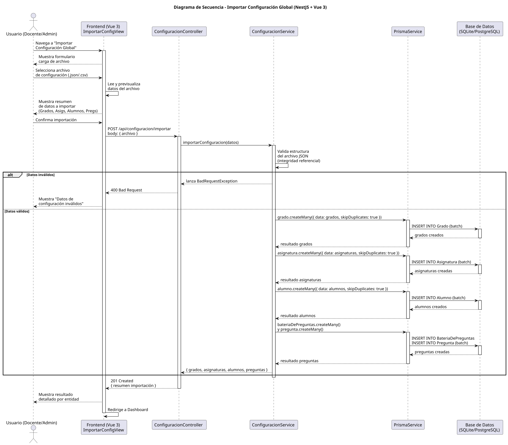

# 25-26-idsw2-sdVC > importarConfiguracionGlobal > Diseño

## Información del artefacto

| Campo | Valor |
|-------|-------|
| **Proyecto** | Sistema de Gestión de Exámenes Universitarios |
| **Fase RUP** | Elaboración |
| **Disciplina** | Diseño |
| **Versión** | 1.0 (NestJS + Vue 3) |
| **Fecha** | 2026-06-03 |
| **Autor** | Marcos Gutierrez |

## Propósito

Detallar la interacción entre los componentes del sistema para importar de forma masiva la configuración global (grados, asignaturas, alumnos, preguntas) desde un archivo externo, validando los datos y persistiendo las entidades en orden respetando las dependencias referenciales.

## Diagrama de secuencia de diseño

||
|-|
|Código fuente: [secuencia.puml](../../../modelosUML/diseño/importarConfiguracionGlobal/secuencia.puml)|

## Participantes

| Componente | Responsabilidad |
|---|---|
| **Frontend (Vue 3)** | ImportarConfigView que permite al usuario cargar un archivo de configuración, previsualizar los datos detectados, solicitar confirmación y mostrar el resultado detallado de la importación. |
| **ConfiguracionController** | Endpoint REST `POST /api/configuracion/importar` que recibe el archivo de configuración y delega en el servicio. |
| **ConfiguracionService** | Lógica de validación del archivo, orquestación de la importación batch en el orden correcto (grados → asignaturas → alumnos → baterías/preguntas) y control de duplicados. |
| **PrismaService** | Capa ORM que ejecuta las operaciones batch mediante `createMany()` con `skipDuplicates` para importaciones idempotentes. |
| **Base de Datos (SQLite/PostgreSQL)** | Almacena las entidades importadas respetando las restricciones de clave foránea. |

## Decisiones de diseño

| Decisión | Justificación |
|---|---|
| **Importación en orden jerárquico** | Primero grados (sin FK), luego asignaturas (FK→grado), luego alumnos (FK→grado), por último baterías y preguntas (FK→asignatura/batería), respetando las dependencias referenciales. |
| **Validación previa completa** | Se valida toda la estructura del archivo antes de persistir nada, evitando importaciones parciales o inconsistentes. |
| **skipDuplicates en batch** | Las operaciones `createMany` usan `skipDuplicates: true` para permitir reimportaciones sin errores por claves duplicadas (dni, email, código). |
| **Previsualización antes de importar** | El frontend lee el archivo y muestra un resumen de datos detectados para que el usuario confirme antes de enviar al backend. |
| **Servicio dedicado** | `ConfiguracionService` encapsula la lógica de importación sin acoplar los servicios existentes (GradosService, AlumnosService, etc.), manteniendo la separación de responsabilidades. |
| **Formato de archivo JSON** | Formato estructurado que permite representar relaciones jerárquicas (grado → asignaturas → alumnos, batería → preguntas) de forma natural. |
| **Transaccionalidad implícita** | Cada `createMany` se ejecuta en una transacción separada. Para importaciones críticas se podría usar `prisma.$transaction()` para atomicidad completa. |
| **Seguridad por capas** | `JwtAuthGuard` + `RolesGuard` protegen el endpoint. Solo usuarios con rol `DOCENTE` o `ADMIN` pueden importar configuración. |

> **Nota:** Este caso de uso está priorizado como #3 pero no tiene implementación en código. El diseño propuesto sigue los patrones del resto del sistema y está listo para implementarse como `src/apps/backend/src/configuracion/` con su controlador, servicio y DTO correspondientes.
