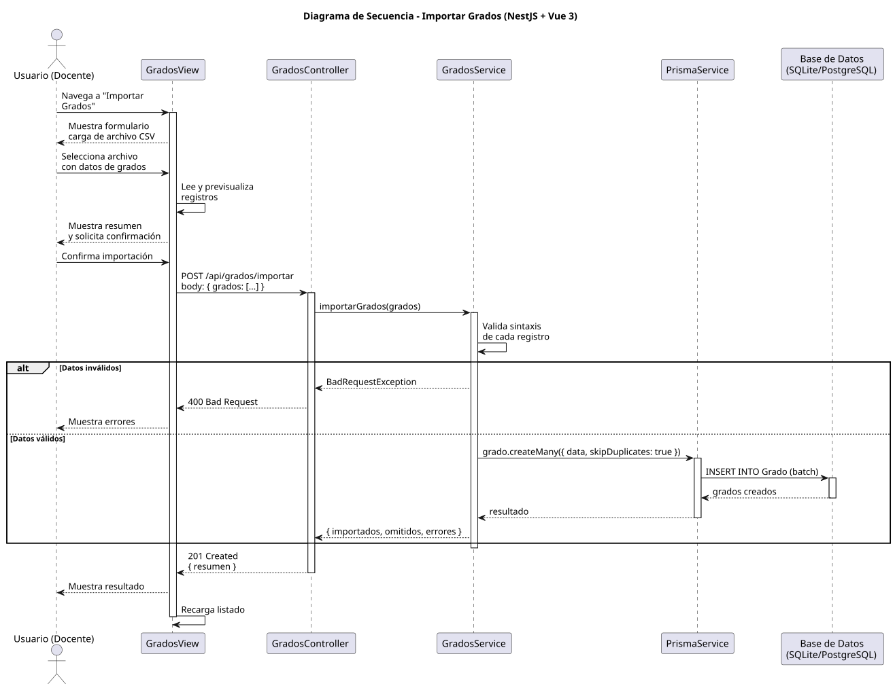

# 25-26-idsw2-sdVC > importarGrados > Diseño

## Información del artefacto

| Campo | Valor |
|-------|-------|
| **Proyecto** | Sistema de Gestión de Exámenes Universitarios |
| **Fase RUP** | Elaboración |
| **Disciplina** | Diseño |
| **Versión** | 1.0 (NestJS + Vue 3) |
| **Fecha** | 2026-06-09 |
| **Autor** | Marcos Gutierrez |

## Propósito

Importar grados desde un archivo CSV, con validación y carga masiva mediante createMany.

## Diagrama de secuencia de diseño

||
|-|
|Código fuente: [secuencia.puml](../../../modelosUML/diseño/importarGrados/secuencia.puml)|

## Participantes

| Componente | Responsabilidad |
|---|---|
| **GradosView** | Carga CSV y previsualización. |
| **GradosController** | POST /api/grados/importar. |
| **GradosService** | importarGrados() con validación y createMany. |
| **PrismaService** | Capa ORM. |
| **Base de Datos** | Almacena grados. |

## Decisiones de diseño

| Decisión | Justificación |
|---|---|
| **createMany con skipDuplicates** | Carga rápida ignorando duplicados. |
| **Previsualización** | Usuario confirma antes de importar. |
| **Resumen detallado** | Muestra importados, omitidos y errores. |
