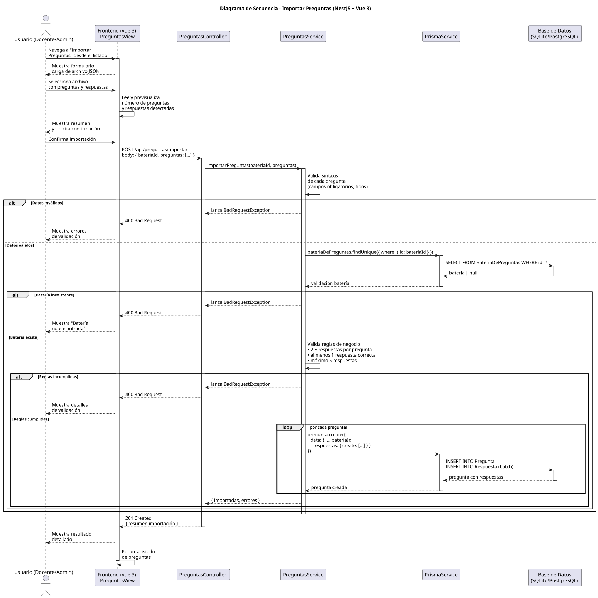

# 25-26-idsw2-sdVC > importarPreguntas > Diseño

## Información del artefacto

| Campo | Valor |
|-------|-------|
| **Proyecto** | Sistema de Gestión de Exámenes Universitarios |
| **Fase RUP** | Elaboración |
| **Disciplina** | Diseño |
| **Versión** | 1.0 (NestJS + Vue 3) |
| **Fecha** | 2026-06-03 |
| **Autor** | Marcos Gutierrez |

## Propósito

Detallar la interacción entre los componentes del sistema para importar preguntas con sus respuestas de forma masiva desde un archivo JSON, validando los datos (formato, batería destino, reglas de negocio) y persistiendo cada pregunta con sus respuestas asociadas en una operación transaccional.

## Diagrama de secuencia de diseño

||
|-|
|Código fuente: [secuencia.puml](../../../modelosUML/diseño/importarPreguntas/secuencia.puml)|

## Participantes

| Componente | Responsabilidad |
|---|---|
| **Frontend (Vue 3)** | PreguntasView que permite al usuario cargar un archivo JSON, previsualizar las preguntas detectadas y mostrar el resultado detallado de la importación. |
| **PreguntasController** | Endpoint REST `POST /api/preguntas/importar` que recibe el array de preguntas con respuestas y la batería destino. |
| **PreguntasService** | Lógica de validación sintáctica (campos obligatorios), validación de existencia de la batería, validación de reglas de negocio (2-5 respuestas, al menos una correcta), y creación transaccional de preguntas con respuestas anidadas. |
| **PrismaService** | Capa ORM que ejecuta las operaciones de creación de preguntas con sus respuestas mediante nested `create`. |
| **Base de Datos (SQLite/PostgreSQL)** | Almacena las preguntas y respuestas importadas respetando las restricciones de FK y las reglas de integridad. |

## Decisiones de diseño

| Decisión | Justificación |
|---|---|
| **Creación individual con nested create** | Cada pregunta se crea con `prisma.pregunta.create({ data: { ..., respuestas: { create: [...] } } })` para garantizar la atomicidad pregunta + respuestas en una sola operación. |
| **Validación en tres capas** | Validación sintáctica (formato), validación de referencia (batería existe), validación de reglas de negocio (2-5 respuestas, 1 correcta). Cada capa puede rechazar antes de pasar a la siguiente. |
| **Previsualización en frontend** | El frontend lee el archivo y muestra un resumen antes de enviar al backend, permitiendo al usuario confirmar o corregir. |
| **Formato JSON** | JSON permite representar la estructura jerárquica pregunta → respuestas de forma natural, a diferencia de CSV que requeriría normalización. |
| **Loop transaccional por pregunta** | Se itera sobre cada pregunta creándola con sus respuestas en una transacción implícita, permitiendo identificar errores por pregunta individual. |
| **Extensión de PreguntasService** | Se añade el método `importarPreguntas()` al servicio existente, manteniendo la lógica de preguntas unificada. |
| **Batería destino explícita** | El `bateriaId` se envía desde el frontend (seleccionado por el usuario o inferido del contexto), no se adivina desde el archivo. |
| **Seguridad por capas** | `JwtAuthGuard` + `RolesGuard` protegen el endpoint. Solo usuarios con rol `DOCENTE` o `ADMIN` pueden importar preguntas. |
