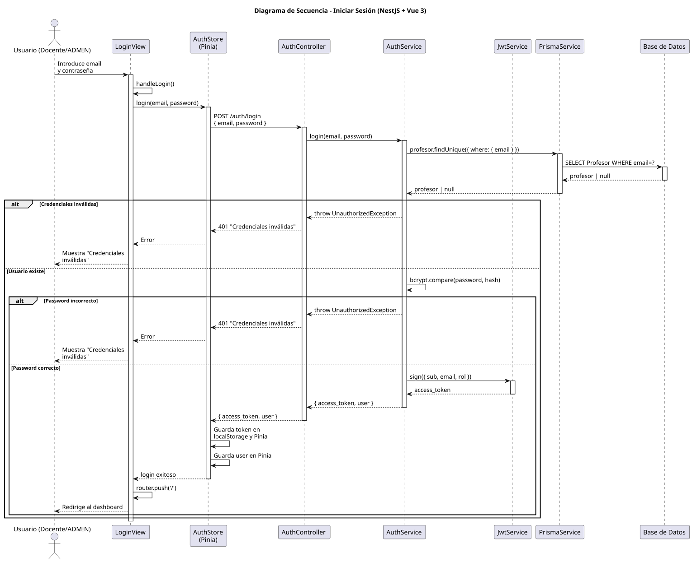

# 25-26-idsw2-sdVC > iniciarSesion > Diseño

## Información del artefacto

| Campo | Valor |
|-------|-------|
| **Proyecto** | Sistema de Gestión de Exámenes Universitarios |
| **Fase RUP** | Elaboración |
| **Disciplina** | Diseño |
| **Versión** | 1.0 (NestJS + Vue 3) |
| **Fecha** | 2026-06-09 |
| **Autor** | Marcos Gutierrez |

## Propósito

Autenticar un usuario (docente/administrador) mediante email y contraseña, devolviendo un JWT para autorizar peticiones posteriores.

## Diagrama de secuencia de diseño

||
|-|
|Código fuente: [secuencia.puml](../../../modelosUML/diseño/iniciarSesion/secuencia.puml)|

## Participantes

| Componente | Responsabilidad |
|---|---|
| **LoginView** | Formulario email + password. |
| **AuthStore (Pinia)** | Llamada HTTP, almacena token en localStorage y usuario en estado. |
| **AuthController** | POST /auth/login (público). |
| **AuthService** | Validación de credenciales y firma JWT. |
| **JwtService** | Firma del token JWT. |
| **PrismaService** | Búsqueda de Profesor por email. |
| **Base de Datos** | Almacena docentes con password hasheado. |

## Decisiones de diseño

| Decisión | Justificación |
|---|---|
| **JWT Bearer Token** | Stateless, almacenado en localStorage + Pinia. |
| **bcrypt para passwords** | Hash seguro almacenado en BD, nunca texto plano. |
| **Login público sin guard** | Cualquiera puede intentar autenticarse. |
| **Mensaje único "Credenciales inválidas"** | No revela si el email existe o no (seguridad). |
| **Proxy Vite /api → backend** | Durante desarrollo frontend llama a `/api/auth/login`. |
| **Interceptor Axios** | Adjunta token automáticamente a todas las peticiones. |
| **Router guard** | Redirige a /login si no hay token. Redirige a / si ya autenticado. |
| **Persistencia localStorage** | Token sobrevive al refresco de página. |
