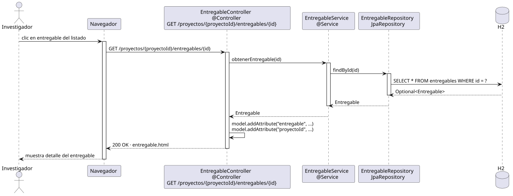

# abrirEntregable — Diseño

## Información del artefacto

- **Proyecto**: FUNIBER GIPF
- **Fase RUP**: Elaboración
- **Disciplina**: Diseño
- **Actor**: Investigador
- **Caso de uso**: abrirEntregable()

## Propósito

Recuperar y mostrar el detalle de un entregable concreto dentro de un proyecto.

## Diagrama de secuencia

[Código PlantUML](../../../modelosUML/diseño/investigador/abrirEntregable.puml)

## Participantes

| Análisis | Spring Boot | Rol |
|---|---|---|
| Controlador de entregables | EntregableController @Controller | Atiende GET /proyectos/{proyectoId}/entregables/{id} y prepara el modelo |
| Servicio de entregables | EntregableService @Service | `obtenerEntregable(id)` carga el entregable por su id |
| Repositorio de entregables | EntregableRepository JpaRepository | SELECT * FROM entregables WHERE id = ? vía findById |
| Base de datos | H2 | Almacén persistente |

## Rutas

| Método | URL | Acción |
|---|---|---|
| GET | /proyectos/{proyectoId}/entregables/{id} | Muestra el detalle de un entregable |

## Decisiones de diseño

- Tanto `proyectoId` como `id` viajan en la URL como `@PathVariable`.
- El modelo recibe tanto el entregable (`model.addAttribute("entregable", ...)`) como el `proyectoId` para facilitar la navegación de vuelta al listado.
- El mismo controller y endpoint que el coordinador.
