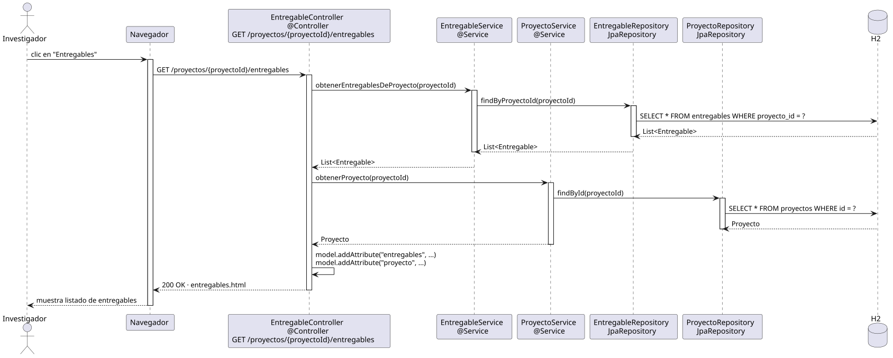

# abrirEntregables — Diseño

## Información del artefacto

- **Proyecto**: FUNIBER GIPF
- **Fase RUP**: Elaboración
- **Disciplina**: Diseño
- **Actor**: Investigador
- **Caso de uso**: abrirEntregables()

## Propósito

Recuperar y mostrar el listado de entregables asociados a un proyecto en el que el investigador participa.

## Diagrama de secuencia

[Código PlantUML](../../../modelosUML/diseño/investigador/abrirEntregables.puml)

## Participantes

| Análisis | Spring Boot | Rol |
|---|---|---|
| Controlador de entregables | EntregableController @Controller | Atiende GET /proyectos/{proyectoId}/entregables y prepara el modelo |
| Servicio de proyectos | ProyectoService @Service | `obtenerProyecto(proyectoId)` carga el proyecto para el encabezado |
| Servicio de entregables | EntregableService @Service | `obtenerEntregablesDeProyecto(proyectoId)` devuelve la lista filtrada |
| Repositorio de proyectos | ProyectoRepository JpaRepository | SELECT * FROM proyectos WHERE id = ? |
| Repositorio de entregables | EntregableRepository JpaRepository | SELECT * FROM entregables WHERE proyecto_id = ? vía findByProyectoId |
| Base de datos | H2 | Almacén persistente |

## Rutas

| Método | URL | Acción |
|---|---|---|
| GET | /proyectos/{proyectoId}/entregables | Muestra el listado de entregables del proyecto |

## Decisiones de diseño

- El `proyectoId` viaja en la URL como `@PathVariable`; los entregables siempre se muestran en contexto de un proyecto.
- Se cargan tanto el proyecto como la lista de entregables y se añaden al modelo con `model.addAttribute`.
- El mismo controller y endpoint que el coordinador; la vista puede adaptar las acciones visibles según el rol.
