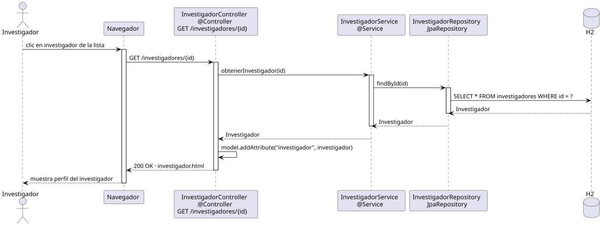

# abrirInvestigador — Diseño

## Información del artefacto

- **Proyecto**: FUNIBER GIPF
- **Fase RUP**: Elaboración
- **Disciplina**: Diseño
- **Actor**: Investigador
- **Caso de uso**: abrirInvestigador()

## Propósito

Mostrar al investigador el perfil detallado de un investigador concreto de la plataforma.

## Diagrama de secuencia

[Código PlantUML](../../../modelosUML/diseño/investigador/abrirInvestigador.puml)

## Participantes

| Análisis | Spring Boot | Rol |
|---|---|---|
| Controlador de investigadores | InvestigadorController @Controller | Atiende GET /investigadores/{id} y prepara el modelo |
| Servicio de investigadores | InvestigadorService @Service | `obtenerInvestigador(id)` carga el investigador por su id |
| Repositorio de investigadores | InvestigadorRepository JpaRepository | SELECT * FROM investigadores WHERE id = ? vía findById |
| Base de datos | H2 | Almacén persistente |

## Rutas

| Método | URL | Acción |
|---|---|---|
| GET | /investigadores/{id} | Muestra el perfil detallado del investigador |

## Decisiones de diseño

- `id` viaja en la URL como `@PathVariable`.
- El modelo recibe el investigador con `model.addAttribute("investigador", ...)` y devuelve `investigador.html`.
- El mismo controller y endpoint que el coordinador; la vista no expone acciones de gestión al investigador.
