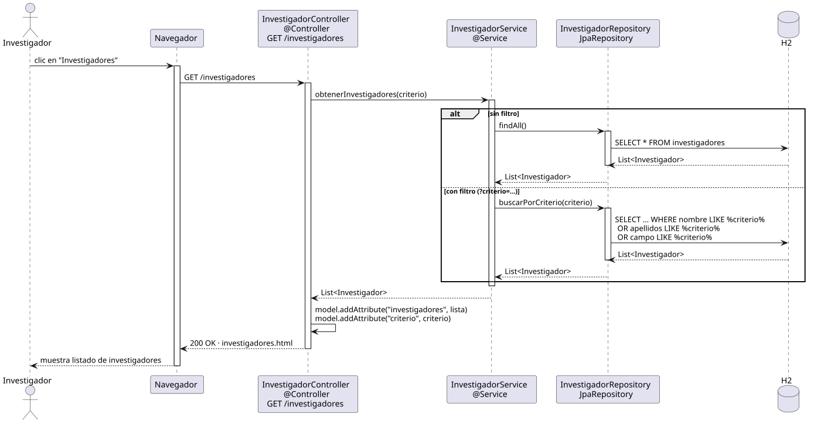

# abrirInvestigadores — Diseño

## Información del artefacto

- **Proyecto**: FUNIBER GIPF
- **Fase RUP**: Elaboración
- **Disciplina**: Diseño
- **Actor**: Investigador
- **Caso de uso**: abrirInvestigadores()

## Propósito

Mostrar al investigador el listado de todos los investigadores de la plataforma, con soporte de búsqueda por criterio.

## Diagrama de secuencia

[Código PlantUML](../../../modelosUML/diseño/investigador/abrirInvestigadores.puml)

## Participantes

| Análisis | Spring Boot | Rol |
|---|---|---|
| Controlador de investigadores | InvestigadorController @Controller | Atiende GET /investigadores y prepara el modelo |
| Servicio de investigadores | InvestigadorService @Service | `obtenerInvestigadores(criterio)` devuelve el listado filtrado o completo |
| Repositorio de investigadores | InvestigadorRepository JpaRepository | findAll() o buscarPorCriterio con LIKE en nombre, apellidos y campo |
| Base de datos | H2 | Almacén persistente |

## Rutas

| Método | URL | Acción |
|---|---|---|
| GET | /investigadores | Muestra el listado de investigadores; admite parámetro de búsqueda |

## Decisiones de diseño

- El criterio de búsqueda se recibe como `@RequestParam` opcional; si está vacío se ejecuta `findAll()`.
- Flujo `alt`: si hay criterio → `buscarPorCriterio(criterio)` con LIKE en nombre, apellidos y campo; si no → `findAll()`.
- El modelo recibe "investigadores" y "criterio" con `model.addAttribute`.
- El mismo controller y endpoint que el coordinador; la vista no expone acciones de gestión al investigador.
