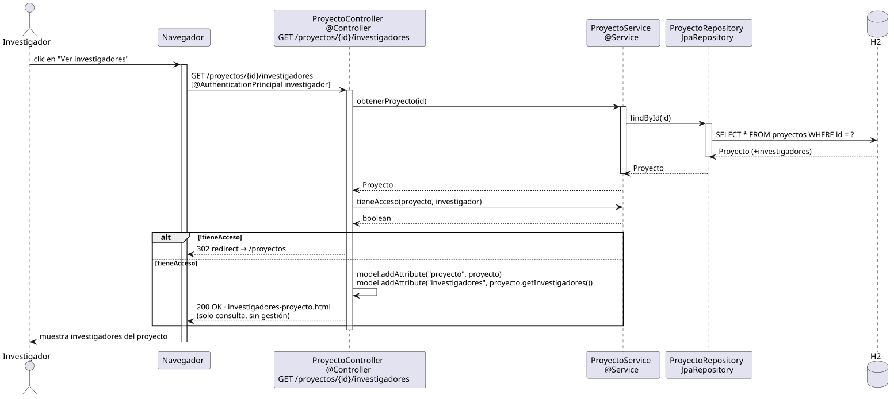

# abrirInvestigadoresDeProyecto — Diseño

## Información del artefacto

- **Proyecto**: FUNIBER GIPF
- **Fase RUP**: Elaboración
- **Disciplina**: Diseño
- **Actor**: Investigador
- **Caso de uso**: abrirInvestigadoresDeProyecto()

## Propósito

Recuperar y mostrar la lista de investigadores asignados a un proyecto al investigador autenticado, solo si pertenece al proyecto.

## Diagrama de secuencia

[Código PlantUML](../../../modelosUML/diseño/investigador/abrirInvestigadoresDeProyecto.puml)

## Participantes

| Análisis | Spring Boot | Rol |
|---|---|---|
| Controlador de proyectos | ProyectoController @Controller | Atiende GET /proyectos/{id}/investigadores con @AuthenticationPrincipal investigador |
| Servicio de proyectos | ProyectoService @Service | `obtenerProyecto(id)` y `tieneAcceso(proyecto, investigador)` |
| Repositorio de proyectos | ProyectoRepository JpaRepository | SELECT * FROM proyectos WHERE id = ? incluyendo investigadores por @ManyToMany |
| Base de datos | H2 | Almacén persistente |

## Rutas

| Método | URL | Acción |
|---|---|---|
| GET | /proyectos/{id}/investigadores | Muestra los investigadores del proyecto (solo si el investigador es miembro) |

## Decisiones de diseño

- Tras cargar el proyecto, el controlador evalúa `tieneAcceso(proyecto, investigador)`.
- Flujo alternativo `alt`: si `!tieneAcceso` → 302 redirect a `/proyectos`; si `tieneAcceso` → se añaden al modelo `"proyecto"` e `"investigadores"` y se devuelve `investigadores-proyecto.html` en modo solo consulta (sin gestión).
- La vista no ofrece opciones de gestión (agregar, eliminar investigador) al investigador.
