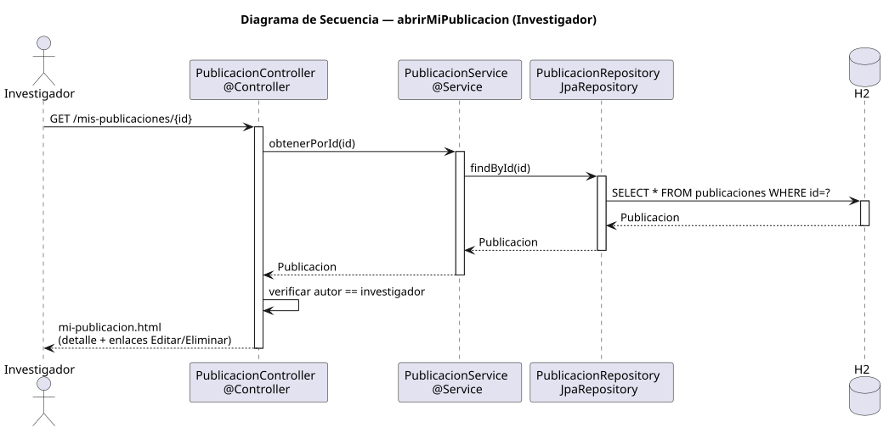

# abrirMiPublicacion — Diseño

## Información del artefacto

- **Proyecto**: FUNIBER GIPF
- **Fase RUP**: Elaboración
- **Disciplina**: Diseño
- **Actor**: Investigador
- **Caso de uso**: abrirMiPublicacion()

## Propósito

Mostrar el detalle de una publicación propia del investigador, con acceso directo a las acciones de editar y eliminar.

## Diagrama de secuencia

[Código PlantUML](../../../modelosUML/diseño/investigador/abrirMiPublicacion.puml)

## Participantes

| Análisis | Spring Boot | Rol |
|---|---|---|
| Controlador de publicaciones | PublicacionController @Controller | Atiende GET /mis-publicaciones/{id}; verifica propiedad y devuelve mi-publicacion.html |
| Servicio de publicaciones | PublicacionService @Service | `obtenerPorId(id)` carga la publicación |
| Repositorio de publicaciones | PublicacionRepository JpaRepository | Ejecuta SELECT * FROM publicaciones WHERE id=? |
| Base de datos | H2 | Almacén persistente |

## Rutas

| Método | URL | Acción |
|---|---|---|
| GET | /mis-publicaciones/{id} | Muestra el detalle de la publicación propia con enlaces Editar y Eliminar |

## Decisiones de diseño

- El controlador verifica que el autor de la publicación coincide con el investigador autenticado (`verificar autor == investigador`); si no coincide, redirige a `/mis-publicaciones`.
- La vista `mi-publicacion.html` muestra el detalle completo y los enlaces Editar y Eliminar.
- Los enlaces apuntan a `/publicaciones/{id}/editar` y `/publicaciones/{id}/eliminar`.
