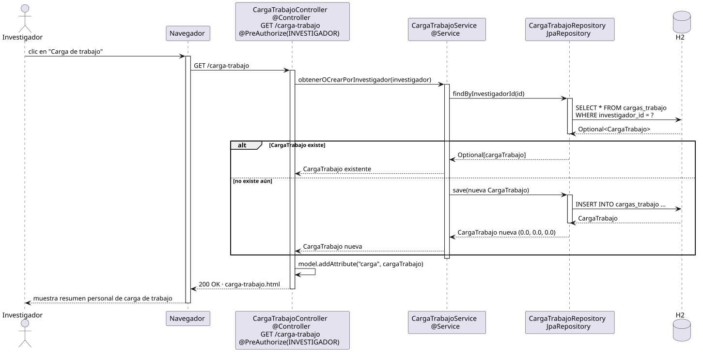

# abrirOpcionesCargaTrabajo — Diseño

## Información del artefacto

- **Proyecto**: FUNIBER GIPF
- **Fase RUP**: Elaboración
- **Disciplina**: Diseño
- **Actor**: Investigador
- **Caso de uso**: abrirOpcionesCargaTrabajo()

## Propósito

Recuperar y mostrar el resumen personal de carga de trabajo del investigador autenticado; crea la entrada si aún no existe.

## Diagrama de secuencia

[Código PlantUML](../../../modelosUML/diseño/investigador/abrirOpcionesCargaTrabajo.puml)

## Participantes

| Análisis | Spring Boot | Rol |
|---|---|---|
| Controlador de carga de trabajo | CargaTrabajoController @Controller @PreAuthorize(INVESTIGADOR) | Atiende GET /carga-trabajo y prepara el modelo |
| Servicio de carga de trabajo | CargaTrabajoService @Service | `obtenerOCrearPorInvestigador(investigador)` busca o crea la CargaTrabajo |
| Repositorio de carga de trabajo | CargaTrabajoRepository JpaRepository | SELECT * FROM cargas_trabajo WHERE investigador_id = ? y INSERT si no existe |
| Base de datos | H2 | Almacén persistente |

## Rutas

| Método | URL | Acción |
|---|---|---|
| GET | /carga-trabajo | Muestra el resumen personal de carga de trabajo del investigador |

## Decisiones de diseño

- Flujo alternativo `alt`: si la CargaTrabajo existe → se devuelve la existente; si no existe → `save(nueva CargaTrabajo)` con valores 0.0, 0.0, 0.0.
- La CargaTrabajo se añade al modelo con `model.addAttribute("carga", cargaTrabajo)`.
- La URL `/carga-trabajo` está protegida con `@PreAuthorize("hasRole('INVESTIGADOR')")` para el flujo del investigador.
