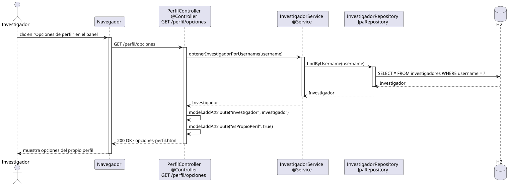

# abrirOpcionesPerfil — Diseño

## Información del artefacto

- **Proyecto**: FUNIBER GIPF
- **Fase RUP**: Elaboración
- **Disciplina**: Diseño
- **Actor**: Investigador
- **Caso de uso**: abrirOpcionesPerfil()

## Propósito

Muestra al investigador las opciones disponibles sobre su propio perfil cargando sus datos por username desde la sesión activa.

## Diagrama de secuencia

[Código PlantUML](../../../modelosUML/diseño/investigador/abrirOpcionesPerfil.puml)

## Participantes

| Análisis | Spring Boot | Rol |
|---|---|---|
| Controlador de perfil | PerfilController @Controller | Atiende GET /perfil/opciones y prepara el modelo |
| Servicio de investigador | InvestigadorService @Service | `obtenerInvestigadorPorUsername(username)` carga el investigador autenticado |
| Repositorio de investigadores | InvestigadorRepository JpaRepository | Ejecuta SELECT * FROM investigadores WHERE username = ? |
| Base de datos | H2 | Almacén persistente |

## Rutas

| Método | URL | Acción |
|---|---|---|
| GET | /perfil/opciones | Muestra las opciones del propio perfil del investigador |

## Decisiones de diseño

- El investigador se carga por `findByUsername(username)` usando el username del `Authentication`, no por id en la URL.
- Se añaden al modelo `"investigador"` y `"esPropioPeril" = true`.
- `esPropioPeril = true` hace que el template oculte el campo rol y el enlace de vuelta al investigador.
