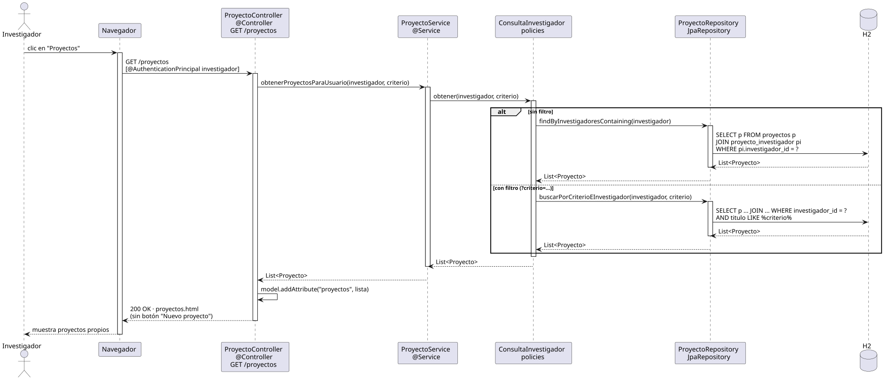

# abrirProyectos — Diseño

## Información del artefacto

- **Proyecto**: FUNIBER GIPF
- **Fase RUP**: Elaboración
- **Disciplina**: Diseño
- **Actor**: Investigador
- **Caso de uso**: abrirProyectos()

## Propósito

Recuperar y mostrar solo los proyectos en los que el investigador autenticado participa como miembro. Soporta búsqueda opcional por criterio de texto filtrada por investigador.

## Diagrama de secuencia

[Código PlantUML](../../../modelosUML/diseño/investigador/abrirProyectos.puml)

## Participantes

| Análisis | Spring Boot | Rol |
|---|---|---|
| Controlador de proyectos | ProyectoController @Controller | Atiende GET /proyectos con @AuthenticationPrincipal investigador |
| Servicio de proyectos | ProyectoService @Service | `obtenerProyectosParaUsuario(investigador, criterio)` delega en la policy del investigador |
| Policy de consulta | ConsultaInvestigador policies | Decide entre `findByInvestigadoresContaining` o `buscarPorCriterioEInvestigador` |
| Repositorio de proyectos | ProyectoRepository JpaRepository | Ejecuta la consulta filtrada por investigador_id en proyecto_investigador |
| Base de datos | H2 | Almacén persistente |

## Rutas

| Método | URL | Acción |
|---|---|---|
| GET | /proyectos | Lista los proyectos del investigador autenticado |
| GET | /proyectos?criterio=texto | Lista proyectos del investigador filtrados por título |

## Decisiones de diseño

- El investigador autenticado llega como `@AuthenticationPrincipal`.
- Flujo alternativo `alt`: sin filtro → `findByInvestigadoresContaining(investigador)` con JOIN sobre proyecto_investigador; con filtro → `buscarPorCriterioEInvestigador(investigador, criterio)`.
- La lista se añade al modelo con `model.addAttribute("proyectos", lista)`.
- La vista no muestra el botón "Nuevo proyecto" para el investigador (visible solo para el coordinador).
