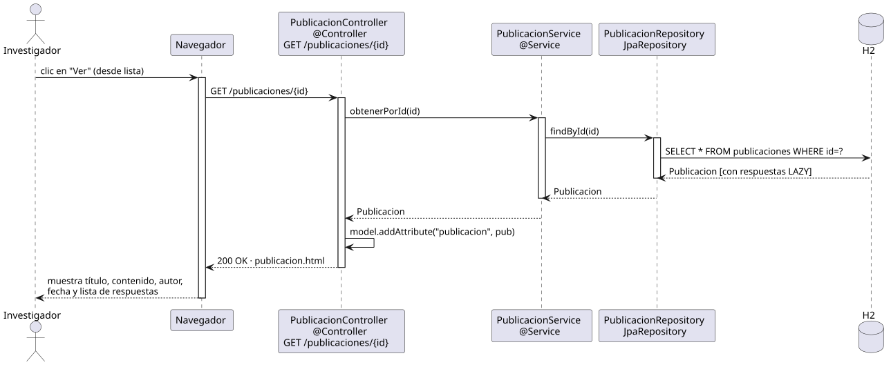

# abrirPublicacion — Diseño

## Información del artefacto

- **Proyecto**: FUNIBER GIPF
- **Fase RUP**: Elaboración
- **Disciplina**: Diseño
- **Actor**: Investigador
- **Caso de uso**: abrirPublicacion()

## Propósito

Recuperar y mostrar el detalle de una publicación: título, contenido, autor, fecha y lista de respuestas asociadas. Comportamiento idéntico al del coordinador; la URL es compartida.

## Diagrama de secuencia

[Código PlantUML](../../../modelosUML/diseño/investigador/abrirPublicacion.puml)

## Participantes

| Análisis | Spring Boot | Rol |
|---|---|---|
| Controlador de publicaciones | PublicacionController @Controller | Atiende GET /publicaciones/{id} y prepara el modelo |
| Servicio de publicaciones | PublicacionService @Service | `obtenerPorId(id)` recupera la publicación con respuestas LAZY |
| Repositorio de publicaciones | PublicacionRepository JpaRepository | Ejecuta SELECT * FROM publicaciones WHERE id=? |
| Base de datos | H2 | Almacén persistente |

## Rutas

| Método | URL | Acción |
|---|---|---|
| GET | /publicaciones/{id} | Muestra el detalle de la publicación con su lista de respuestas |

## Decisiones de diseño

- La publicación se añade al modelo con `model.addAttribute("publicacion", pub)`.
- Las respuestas se cargan en LAZY y se resuelven en el template por open-in-view.
- El formulario de `responderPublicacion` está embebido en la misma vista `publicacion.html`.
