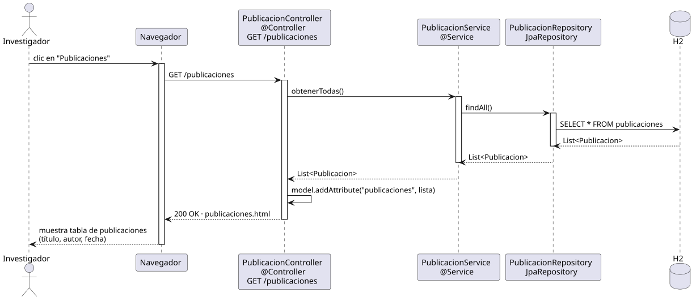

# abrirPublicaciones — Diseño

## Información del artefacto

- **Proyecto**: FUNIBER GIPF
- **Fase RUP**: Elaboración
- **Disciplina**: Diseño
- **Actor**: Investigador
- **Caso de uso**: abrirPublicaciones()

## Propósito

Recuperar y mostrar el listado completo de publicaciones del sistema (título, autor, fecha). Comportamiento idéntico al del coordinador; la URL es compartida.

## Diagrama de secuencia

[Código PlantUML](../../../modelosUML/diseño/investigador/abrirPublicaciones.puml)

## Participantes

| Análisis | Spring Boot | Rol |
|---|---|---|
| Controlador de publicaciones | PublicacionController @Controller | Atiende GET /publicaciones y prepara el modelo |
| Servicio de publicaciones | PublicacionService @Service | `obtenerTodas()` devuelve todas las publicaciones |
| Repositorio de publicaciones | PublicacionRepository JpaRepository | Ejecuta SELECT * FROM publicaciones vía findAll() |
| Base de datos | H2 | Almacén persistente |

## Rutas

| Método | URL | Acción |
|---|---|---|
| GET | /publicaciones | Lista todas las publicaciones del sistema (título, autor, fecha) |

## Decisiones de diseño

- La URL `/publicaciones` es compartida entre ambos actores; no hay bifurcación por rol.
- La lista se añade al modelo con `model.addAttribute("publicaciones", lista)`.
- La vista `publicaciones.html` muestra título, autor y fecha de cada publicación.
