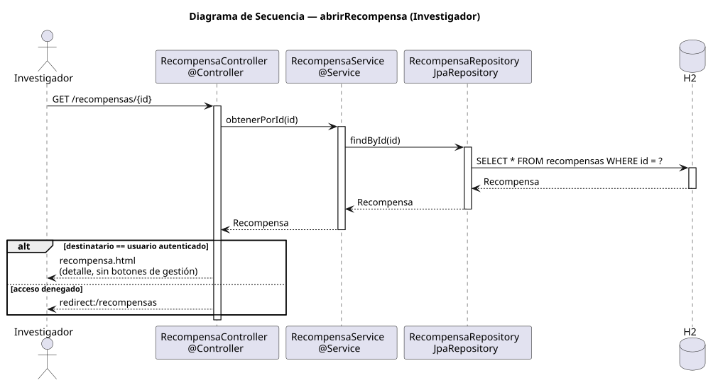

# abrirRecompensa — Diseño

## Información del artefacto

- **Proyecto**: FUNIBER GIPF
- **Fase RUP**: Elaboración
- **Disciplina**: Diseño
- **Actor**: Investigador
- **Caso de uso**: abrirRecompensa()

## Propósito

Mostrar al investigador el detalle completo de una recompensa que le ha sido asignada; redirige si el investigador no es el destinatario.

## Diagrama de secuencia

[Código PlantUML](../../../modelosUML/diseño/investigador/abrirRecompensa.puml)

## Participantes

| Análisis | Spring Boot | Rol |
|---|---|---|
| Controlador de recompensas | RecompensaController @Controller | Atiende GET /recompensas/{id}; verifica que el destinatario coincide con el usuario autenticado |
| Servicio de recompensas | RecompensaService @Service | `obtenerPorId(id)` recupera la recompensa |
| Repositorio de recompensas | RecompensaRepository JpaRepository | Ejecuta SELECT * FROM recompensas WHERE id = ? |
| Base de datos | H2 | Almacén persistente |

## Rutas

| Método | URL | Acción |
|---|---|---|
| GET | /recompensas/{id} | Muestra el detalle si el investigador es el destinatario; redirige en caso contrario |

## Decisiones de diseño

- Flujo alternativo `alt`: si `destinatario == usuario autenticado` → vista `recompensa.html` (sin botones de gestión); si acceso denegado → redirect a `/recompensas`.
- La vista no muestra los botones de editar ni eliminar para el investigador.
