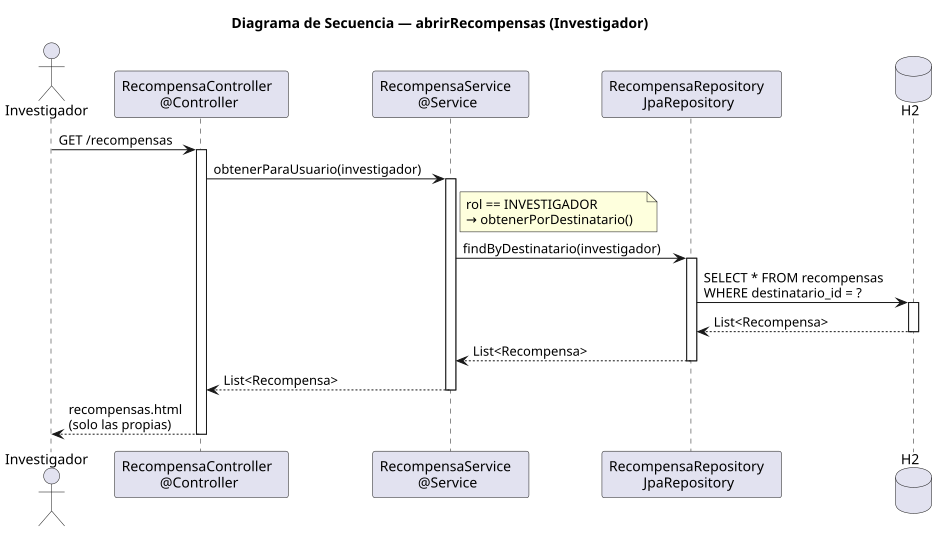

# abrirRecompensas — Diseño

## Información del artefacto

- **Proyecto**: FUNIBER GIPF
- **Fase RUP**: Elaboración
- **Disciplina**: Diseño
- **Actor**: Investigador
- **Caso de uso**: abrirRecompensas()

## Propósito

Mostrar al investigador autenticado únicamente las recompensas que le han sido asignadas por el coordinador.

## Diagrama de secuencia

[Código PlantUML](../../../modelosUML/diseño/investigador/abrirRecompensas.puml)

## Participantes

| Análisis | Spring Boot | Rol |
|---|---|---|
| Controlador de recompensas | RecompensaController @Controller | Atiende GET /recompensas; detecta rol INVESTIGADOR |
| Servicio de recompensas | RecompensaService @Service | `obtenerParaUsuario(investigador)` → rol INVESTIGADOR → `obtenerPorDestinatario()` via findByDestinatario |
| Repositorio de recompensas | RecompensaRepository JpaRepository | Ejecuta SELECT * FROM recompensas WHERE destinatario_id = ? |
| Base de datos | H2 | Almacén persistente |

## Rutas

| Método | URL | Acción |
|---|---|---|
| GET | /recompensas | Muestra las recompensas asignadas al investigador autenticado |

## Decisiones de diseño

- El mismo endpoint `/recompensas` sirve a ambos roles; la nota en el servicio indica `rol == INVESTIGADOR → obtenerPorDestinatario()`.
- El investigador solo ve sus propias recompensas; no tiene acceso a crear, editar ni eliminar.
- La vista `recompensas.html` muestra solo las recompensas propias.
