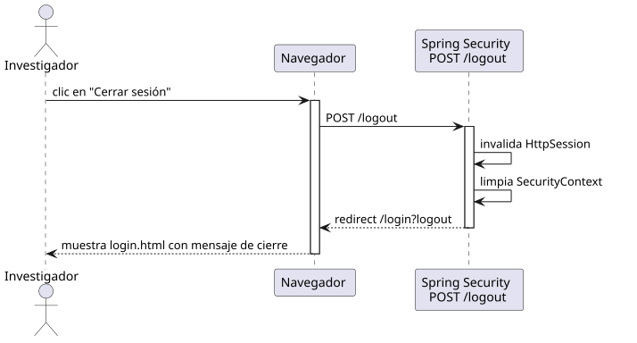

# cerrarSesion — Diseño

## Información del artefacto

- **Proyecto**: FUNIBER GIPF
- **Fase RUP**: Elaboración
- **Disciplina**: Diseño
- **Actor**: Investigador
- **Caso de uso**: cerrarSesion()

## Propósito

Permite al investigador cerrar su sesión activa; Spring Security invalida la sesión HTTP y limpia el contexto de seguridad, redirigiendo al formulario de login.

## Diagrama de secuencia

[Código PlantUML](../../../modelosUML/diseño/investigador/cerrarSesion.puml)

## Participantes

| Análisis | Spring Boot | Rol |
|---|---|---|
| Sistema de seguridad | Spring Security POST /logout | Gestiona el cierre de sesión invalidando la HttpSession y limpiando el SecurityContext |

## Rutas

| Método | URL | Acción |
|---|---|---|
| POST | /logout | Spring Security invalida la sesión y redirige a /login?logout |

## Decisiones de diseño

- El cierre de sesión se gestiona íntegramente por Spring Security, sin controlador de aplicación.
- Se ejecutan dos pasos internos: `invalida HttpSession` y `limpia SecurityContext`.
- Tras el logout, Spring Security redirige a `/login?logout`.
- El flujo es idéntico al del coordinador; ambos actores usan el mismo endpoint de Spring Security.
