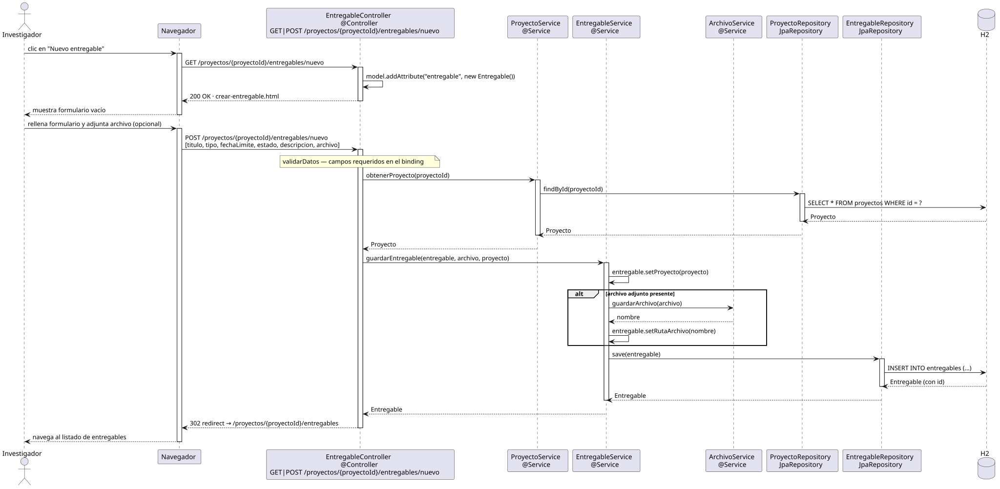

# crearEntregable — Diseño

## Información del artefacto

- **Proyecto**: FUNIBER GIPF
- **Fase RUP**: Elaboración
- **Disciplina**: Diseño
- **Actor**: Investigador
- **Caso de uso**: crearEntregable()

## Propósito

Permitir al investigador crear un nuevo entregable dentro de un proyecto, incluyendo opcionalmente la subida de un archivo adjunto.

## Diagrama de secuencia

[Código PlantUML](../../../modelosUML/diseño/investigador/crearEntregable.puml)

## Participantes

| Análisis | Spring Boot | Rol |
|---|---|---|
| Controlador de entregables | EntregableController @Controller | Atiende GET y POST /proyectos/{proyectoId}/entregables/nuevo |
| Servicio de proyectos | ProyectoService @Service | `obtenerProyecto(proyectoId)` carga el proyecto al que pertenece el entregable |
| Servicio de entregables | EntregableService @Service | `guardarEntregable(entregable, archivo, proyecto)` persiste el nuevo entregable |
| Servicio de archivos | ArchivoService @Service | `guardarArchivo(archivo)` almacena el fichero si se adjunta uno |
| Repositorio de proyectos | ProyectoRepository JpaRepository | SELECT * FROM proyectos WHERE id = ? |
| Repositorio de entregables | EntregableRepository JpaRepository | INSERT INTO entregables vía save |
| Base de datos | H2 | Almacén persistente |

## Rutas

| Método | URL | Acción |
|---|---|---|
| GET | /proyectos/{proyectoId}/entregables/nuevo | Muestra el formulario de creación |
| POST | /proyectos/{proyectoId}/entregables/nuevo | Persiste el entregable y redirige al listado |

## Decisiones de diseño

- `proyectoId` viaja en la URL como `@PathVariable`.
- Se aplica `@Valid` y `validarDatos` sobre el entregable antes de persistir.
- Flujo `alt` en `guardarEntregable`: si se adjunta un archivo → `ArchivoService.guardarArchivo(archivo)` antes del INSERT; si no → INSERT directo.
- Tras el POST exitoso, la respuesta es un 302 redirect al listado de entregables del proyecto (`/proyectos/{proyectoId}/entregables`).
- El mismo controller y endpoint que el coordinador.
