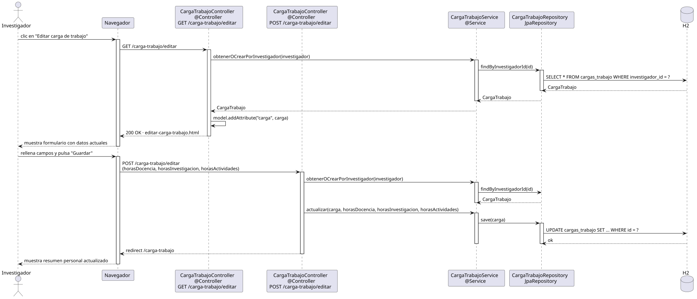

# editarCargaTrabajo — Diseño

## Información del artefacto

- **Proyecto**: FUNIBER GIPF
- **Fase RUP**: Elaboración
- **Disciplina**: Diseño
- **Actor**: Investigador
- **Caso de uso**: editarCargaTrabajo()

## Propósito

Mostrar el formulario de edición de la carga de trabajo propia del investigador autenticado y persistir los cambios.

## Diagrama de secuencia

[Código PlantUML](../../../modelosUML/diseño/investigador/editarCargaTrabajo.puml)

## Participantes

| Análisis | Spring Boot | Rol |
|---|---|---|
| Controlador de carga de trabajo (GET) | CargaTrabajoController @Controller GET /carga-trabajo/editar | Carga la CargaTrabajo del investigador y sirve el formulario |
| Controlador de carga de trabajo (POST) | CargaTrabajoController @Controller POST /carga-trabajo/editar | Recibe los tres campos y persiste los cambios |
| Servicio de carga de trabajo | CargaTrabajoService @Service | `obtenerOCrearPorInvestigador(investigador)` y `actualizar(carga, horas...)` |
| Repositorio de carga de trabajo | CargaTrabajoRepository JpaRepository | SELECT por investigador_id y UPDATE vía save(carga) |
| Base de datos | H2 | Almacén persistente |

## Rutas

| Método | URL | Acción |
|---|---|---|
| GET | /carga-trabajo/editar | Muestra el formulario con los datos actuales de la carga de trabajo |
| POST | /carga-trabajo/editar | Persiste horasDocencia, horasInvestigacion, horasActividades y redirige |

## Decisiones de diseño

- La CargaTrabajo se añade al modelo con `model.addAttribute("carga", carga)` en el GET.
- El POST llama a `obtenerOCrearPorInvestigador(investigador)` para obtener la entidad y luego a `actualizar(carga, horasDocencia, horasInvestigacion, horasActividades)` que aplica los setters y llama a `save(carga)`.
- Tras guardar, redirige a `redirect:/carga-trabajo` (302).
