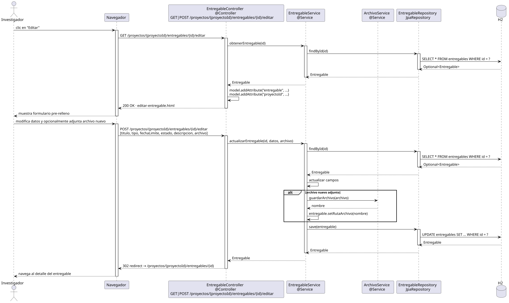

# editarEntregable — Diseño

## Información del artefacto

- **Proyecto**: FUNIBER GIPF
- **Fase RUP**: Elaboración
- **Disciplina**: Diseño
- **Actor**: Investigador
- **Caso de uso**: editarEntregable()

## Propósito

Permitir al investigador modificar los datos y/o el archivo adjunto de un entregable existente en un proyecto.

## Diagrama de secuencia

[Código PlantUML](../../../modelosUML/diseño/investigador/editarEntregable.puml)

## Participantes

| Análisis | Spring Boot | Rol |
|---|---|---|
| Controlador de entregables | EntregableController @Controller | Atiende GET y POST /proyectos/{proyectoId}/entregables/{id}/editar |
| Servicio de entregables | EntregableService @Service | `obtenerEntregable(id)` carga el entregable; `actualizarEntregable(entregable, archivo)` aplica cambios |
| Servicio de archivos | ArchivoService @Service | `guardarArchivo(archivo)` almacena el nuevo fichero si se adjunta uno |
| Repositorio de entregables | EntregableRepository JpaRepository | SELECT / UPDATE vía findById + save |
| Base de datos | H2 | Almacén persistente |

## Rutas

| Método | URL | Acción |
|---|---|---|
| GET | /proyectos/{proyectoId}/entregables/{id}/editar | Muestra el formulario precargado con los datos actuales |
| POST | /proyectos/{proyectoId}/entregables/{id}/editar | Persiste los cambios y redirige al detalle |

## Decisiones de diseño

- `proyectoId` e `id` viajan en la URL como `@PathVariable`.
- Flujo `alt` en `actualizarEntregable`: si se adjunta un nuevo archivo → `ArchivoService.guardarArchivo(archivo)` antes del UPDATE; si no → UPDATE directo.
- Tras el POST exitoso, la respuesta es un 302 redirect al detalle del entregable (`/proyectos/{proyectoId}/entregables/{id}`).
- El mismo controller y endpoint que el coordinador.
