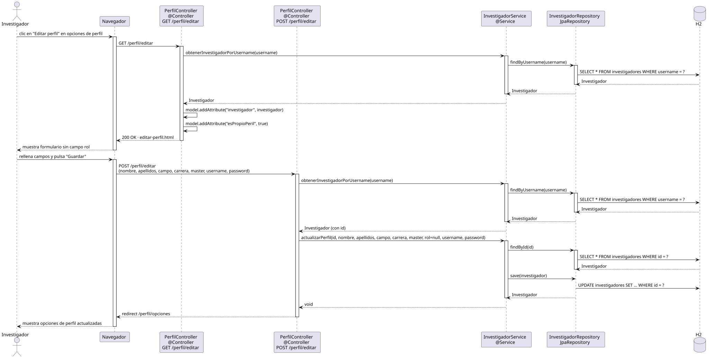

# editarPerfil — Diseño

## Información del artefacto

- **Proyecto**: FUNIBER GIPF
- **Fase RUP**: Elaboración
- **Disciplina**: Diseño
- **Actor**: Investigador
- **Caso de uso**: editarPerfil()

## Propósito

Presenta al investigador un formulario editable con sus propios datos de perfil, sin el campo rol, y persiste los cambios.

## Diagrama de secuencia

[Código PlantUML](../../../modelosUML/diseño/investigador/editarPerfil.puml)

## Participantes

| Análisis | Spring Boot | Rol |
|---|---|---|
| Controlador de perfil (GET) | PerfilController @Controller GET /perfil/editar | Carga el investigador por username y sirve el formulario |
| Controlador de perfil (POST) | PerfilController @Controller POST /perfil/editar | Persiste los cambios sin modificar el rol |
| Servicio de investigador | InvestigadorService @Service | `obtenerInvestigadorPorUsername(username)` y `actualizarPerfil(id, ..., rol=null, ...)` |
| Repositorio de investigadores | InvestigadorRepository JpaRepository | SELECT por username y UPDATE por id vía save(investigador) |
| Base de datos | H2 | Almacén persistente |

## Rutas

| Método | URL | Acción |
|---|---|---|
| GET | /perfil/editar | Muestra el formulario del propio perfil sin campo rol |
| POST | /perfil/editar | Guarda nombre, apellidos, campo, carrera, master, username, password (sin modificar rol) |

## Decisiones de diseño

- En GET y POST, el investigador se carga por `findByUsername(username)` del `Authentication`.
- El POST llama a `actualizarPerfil(id, nombre, apellidos, campo, carrera, master, rol=null, username, password)`; el rol se pasa como `null` para que no se modifique.
- El formulario no incluye el campo `rol`; el template lo oculta con `esPropioPeril = true`.
- Tras guardar, redirige a `redirect:/perfil/opciones` (302).
