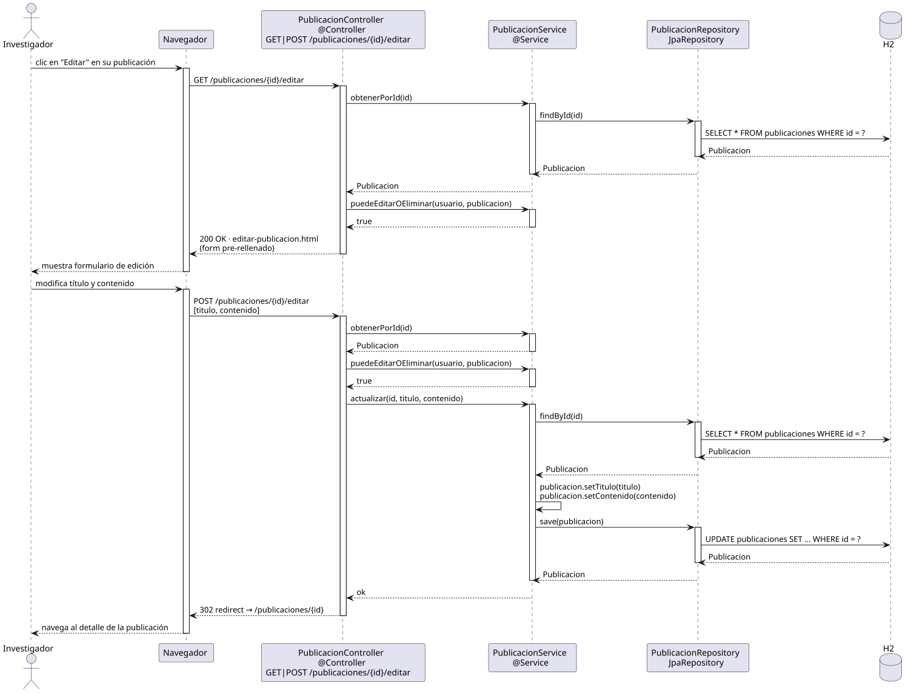

# editarPublicacion — Diseño

## Información del artefacto

- **Proyecto**: FUNIBER GIPF
- **Fase RUP**: Elaboración
- **Disciplina**: Diseño
- **Actor**: Investigador
- **Caso de uso**: editarPublicacion()

## Propósito

Permitir al investigador editar el título y el contenido de una publicación propia, previa verificación de que tiene permiso para hacerlo.

## Diagrama de secuencia

[Código PlantUML](../../../modelosUML/diseño/investigador/editarPublicacion.puml)

## Participantes

| Análisis | Spring Boot | Rol |
|---|---|---|
| Controlador de publicaciones | PublicacionController @Controller | Atiende GET y POST /publicaciones/{id}/editar |
| Servicio de publicaciones | PublicacionService @Service | `puedeEditarOEliminar(usuario, publicacion)` verifica permisos; `actualizar(id, titulo, contenido)` aplica los cambios |
| Repositorio de publicaciones | PublicacionRepository JpaRepository | SELECT / UPDATE vía findById + save |
| Base de datos | H2 | Almacén persistente |

## Rutas

| Método | URL | Acción |
|---|---|---|
| GET | /publicaciones/{id}/editar | Muestra el formulario si el investigador tiene permiso; redirige si no |
| POST | /publicaciones/{id}/editar | Persiste los cambios y redirige al detalle de la publicación |

## Decisiones de diseño

- `id` viaja en la URL como `@PathVariable`; el investigador autenticado se obtiene con `@AuthenticationPrincipal`.
- En GET y POST se invoca `puedeEditarOEliminar(usuario, publicacion)`: si devuelve `false` → 302 redirect sin editar.
- `actualizar(id, titulo, contenido)` ejecuta `setTitulo`, `setContenido` y `save` (UPDATE).
- Tras el POST exitoso, la respuesta es un 302 redirect a `/publicaciones/{id}`.
- El mismo controller y endpoint que el coordinador.
