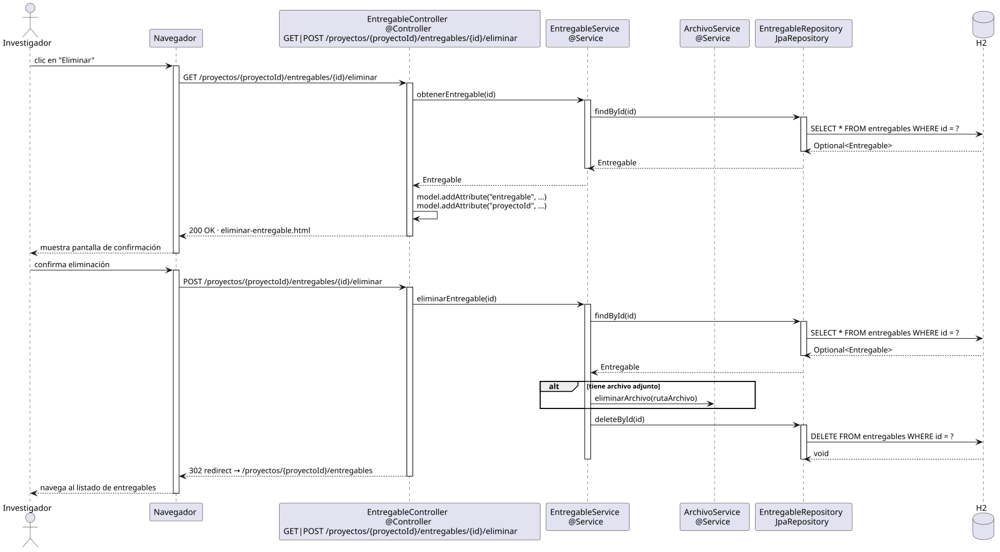

# eliminarEntregable — Diseño

## Información del artefacto

- **Proyecto**: FUNIBER GIPF
- **Fase RUP**: Elaboración
- **Disciplina**: Diseño
- **Actor**: Investigador
- **Caso de uso**: eliminarEntregable()

## Propósito

Permitir al investigador eliminar un entregable de un proyecto, incluyendo el borrado de su archivo adjunto si lo tiene.

## Diagrama de secuencia

[Código PlantUML](../../../modelosUML/diseño/investigador/eliminarEntregable.puml)

## Participantes

| Análisis | Spring Boot | Rol |
|---|---|---|
| Controlador de entregables | EntregableController @Controller | Atiende GET y POST /proyectos/{proyectoId}/entregables/{id}/eliminar |
| Servicio de entregables | EntregableService @Service | Carga el entregable vía findById y ejecuta la eliminación con deleteById |
| Servicio de archivos | ArchivoService @Service | `eliminarArchivo(ruta)` borra el fichero adjunto si existe |
| Repositorio de entregables | EntregableRepository JpaRepository | SELECT / DELETE vía findById + deleteById |
| Base de datos | H2 | Almacén persistente |

## Rutas

| Método | URL | Acción |
|---|---|---|
| GET | /proyectos/{proyectoId}/entregables/{id}/eliminar | Muestra la pantalla de confirmación |
| POST | /proyectos/{proyectoId}/entregables/{id}/eliminar | Elimina el entregable y redirige al listado |

## Decisiones de diseño

- `proyectoId` e `id` viajan en la URL como `@PathVariable`.
- Flujo `alt` en el POST: si el entregable tiene archivo adjunto → `ArchivoService.eliminarArchivo(ruta)` antes de `deleteById`; si no → `deleteById` directo.
- Tras el POST exitoso, la respuesta es un 302 redirect al listado de entregables (`/proyectos/{proyectoId}/entregables`).
- El mismo controller y endpoint que el coordinador.
