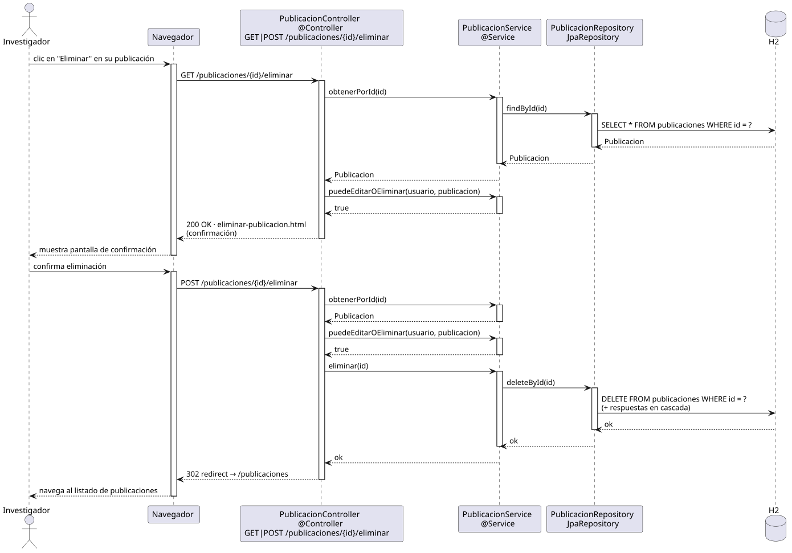

# eliminarPublicacion — Diseño

## Información del artefacto

- **Proyecto**: FUNIBER GIPF
- **Fase RUP**: Elaboración
- **Disciplina**: Diseño
- **Actor**: Investigador
- **Caso de uso**: eliminarPublicacion()

## Propósito

Permitir al investigador eliminar una publicación propia junto con sus respuestas en cascada, previa verificación de permiso.

## Diagrama de secuencia

[Código PlantUML](../../../modelosUML/diseño/investigador/eliminarPublicacion.puml)

## Participantes

| Análisis | Spring Boot | Rol |
|---|---|---|
| Controlador de publicaciones | PublicacionController @Controller | Atiende GET y POST /publicaciones/{id}/eliminar |
| Servicio de publicaciones | PublicacionService @Service | `puedeEditarOEliminar(usuario, publicacion)` verifica permisos; `eliminar(id)` ejecuta el borrado |
| Repositorio de publicaciones | PublicacionRepository JpaRepository | SELECT / DELETE vía findById + deleteById |
| Base de datos | H2 | Almacén persistente |

## Rutas

| Método | URL | Acción |
|---|---|---|
| GET | /publicaciones/{id}/eliminar | Muestra la pantalla de confirmación si el investigador tiene permiso |
| POST | /publicaciones/{id}/eliminar | Elimina la publicación y redirige al listado |

## Decisiones de diseño

- `id` viaja en la URL como `@PathVariable`; el investigador autenticado se obtiene con `@AuthenticationPrincipal`.
- En GET y POST se invoca `puedeEditarOEliminar(usuario, publicacion)`: si devuelve `false` → 302 redirect sin borrar.
- `eliminar(id)` ejecuta `deleteById`; las respuestas se eliminan en cascada por la relación JPA.
- Tras el POST exitoso, la respuesta es un 302 redirect a `/publicaciones`.
- El mismo controller y endpoint que el coordinador.
