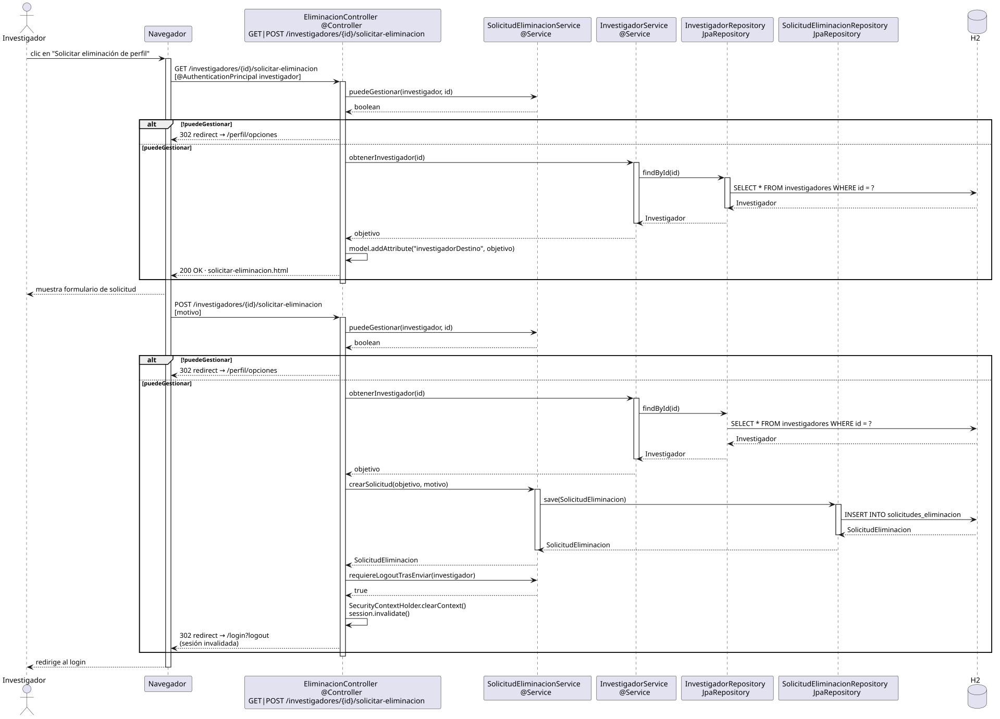

# solicitarEliminacionPerfil — Diseño

## Información del artefacto

- **Proyecto**: FUNIBER GIPF
- **Fase RUP**: Elaboración
- **Disciplina**: Diseño
- **Actor**: Investigador
- **Caso de uso**: solicitarEliminacionPerfil()

## Propósito

Permitir al investigador solicitar la eliminación de su propia cuenta; verifica que el id de la ruta corresponde al investigador autenticado, y tras registrar la solicitud invalida la sesión redirigiendo al login.

## Diagrama de secuencia

[Código PlantUML](../../../modelosUML/diseño/investigador/solicitarEliminacionPerfil.puml)

## Participantes

| Análisis | Spring Boot | Rol |
|---|---|---|
| Controlador de eliminación (GET) | EliminacionController @Controller GET /investigadores/{id}/solicitar-eliminacion | Verifica `puedeGestionar` y sirve el formulario |
| Controlador de eliminación (POST) | EliminacionController @Controller POST /investigadores/{id}/solicitar-eliminacion | Verifica, crea solicitud, invalida sesión y redirige |
| Servicio de solicitud de eliminación | SolicitudEliminacionService @Service | `puedeGestionar(investigador, id)`, `crearSolicitud(objetivo, motivo)` y `requiereLogoutTrasEnviar(investigador)` |
| Servicio de investigador | InvestigadorService @Service | `obtenerInvestigador(id)` carga el investigador objetivo |
| Repositorio de investigadores | InvestigadorRepository JpaRepository | SELECT * FROM investigadores WHERE id = ? |
| Repositorio de solicitudes | SolicitudEliminacionRepository JpaRepository | INSERT INTO solicitudes_eliminacion vía save |
| Base de datos | H2 | Almacén persistente |

## Rutas

| Método | URL | Acción |
|---|---|---|
| GET | /investigadores/{id}/solicitar-eliminacion | Muestra el formulario si puedeGestionar; redirige a /perfil/opciones si no |
| POST | /investigadores/{id}/solicitar-eliminacion | Crea la solicitud, invalida la sesión y redirige a /login?logout |

## Decisiones de diseño

- En GET y POST: flujo `alt` si `!puedeGestionar` → 302 redirect a `/perfil/opciones`; si `puedeGestionar` → continúa.
- Tras crear la solicitud en el POST, `requiereLogoutTrasEnviar(investigador)` devuelve `true`; el controlador ejecuta `SecurityContextHolder.clearContext()` y `session.invalidate()`.
- La sesión se invalida inmediatamente tras enviar la solicitud; el investigador es redirigido a `/login?logout`.
