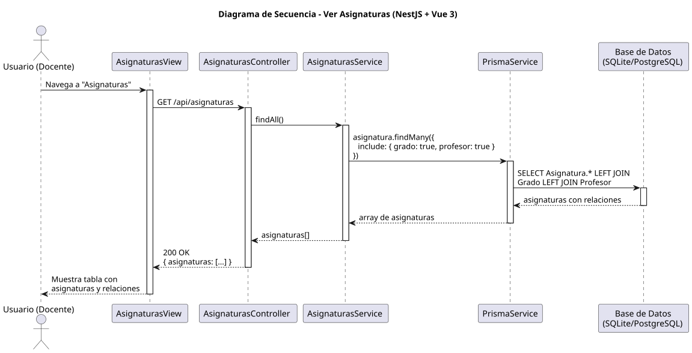

# 25-26-idsw2-sdVC > verAsignaturas > Diseño

## Información del artefacto

| Campo | Valor |
|-------|-------|
| **Proyecto** | Sistema de Gestión de Exámenes Universitarios |
| **Fase RUP** | Elaboración |
| **Disciplina** | Diseño |
| **Versión** | 1.0 (NestJS + Vue 3) |
| **Fecha** | 2026-06-09 |
| **Autor** | Marcos Gutierrez |

## Propósito

Detallar la interacción entre los componentes del sistema para visualizar el listado de asignaturas con sus relaciones (grado, profesor). Caso de solo lectura.

## Diagrama de secuencia de diseño

||
|-|
|Código fuente: [secuencia.puml](../../../modelosUML/diseño/verAsignaturas/secuencia.puml)|

## Participantes

| Componente | Responsabilidad |
|---|---|
| **AsignaturasView** | Vista que muestra tabla de asignaturas con datos de grado y profesor. |
| **AsignaturasController** | Endpoint `GET /api/asignaturas`. |
| **AsignaturasService** | Método `findAll()` con include de grado y profesor. |
| **PrismaService** | Capa ORM que ejecuta consulta con LEFT JOINs. |
| **Base de Datos (SQLite/PostgreSQL)** | Almacena asignaturas con relaciones. |

## Decisiones de diseño

| Decisión | Justificación |
|---|---|
| **Include de grado y profesor** | `findAll()` incluye relaciones para mostrar nombre del grado y profesor en la tabla. |
| **Sin filtros** | La implementación actual no aplica filtros; se muestran todas las asignaturas. |
| **Sin paginación** | Se asume volumen manejable de asignaturas. |
| **Caso de solo lectura** | GET únicamente — sin persistencia. |
| **Seguridad por capas** | Solo `DOCENTE` o `ADMIN` pueden ver asignaturas. |
| **DataTable de PrimeVue** | La vista usa PrimeVue DataTable con ordenación y búsqueda en frontend. |
| **Respuesta completa** | Cada asignatura incluye grado y profesor asociados. |
| **Consulta eficiente** | Un solo `findMany` con include evita N+1 queries. |
