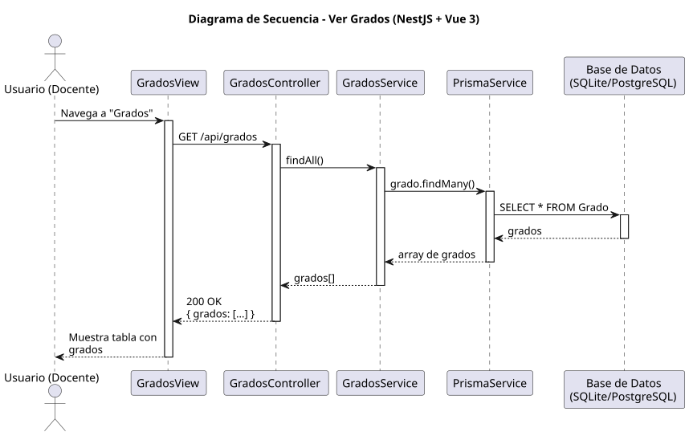

# 25-26-idsw2-sdVC > verGrados > Diseño

## Información del artefacto

| Campo | Valor |
|-------|-------|
| **Proyecto** | Sistema de Gestión de Exámenes Universitarios |
| **Fase RUP** | Elaboración |
| **Disciplina** | Diseño |
| **Versión** | 1.0 (NestJS + Vue 3) |
| **Fecha** | 2026-06-09 |
| **Autor** | Marcos Gutierrez |

## Propósito

Detallar la interacción para visualizar el listado de grados universitarios. Caso de solo lectura.

## Diagrama de secuencia de diseño

||
|-|
|Código fuente: [secuencia.puml](../../../modelosUML/diseño/verGrados/secuencia.puml)|

## Participantes

| Componente | Responsabilidad |
|---|---|
| **GradosView** | Vista que muestra tabla de grados. |
| **GradosController** | Endpoint `GET /api/grados`. |
| **GradosService** | Método `findAll()` sin includes. |
| **PrismaService** | Capa ORM. |
| **Base de Datos** | Almacena grados. |

## Decisiones de diseño

| Decisión | Justificación |
|---|---|
| **Consulta simple sin relaciones** | Grado no requiere include — es una entidad raíz sin dependencias. |
| **Sin filtros ni paginación** | Pocos registros, se muestran todos. |
| **Caso de solo lectura** | Solo GET. |
| **Seguridad por capas** | Solo `DOCENTE` o `ADMIN`. |
| **DataTable PrimeVue** | Ordenación y búsqueda en frontend. |
| **Consulta eficiente** | Un solo `findMany` sin joins. |
| **Respuesta directa** | Array de grados con id, titulo, codigo. |
