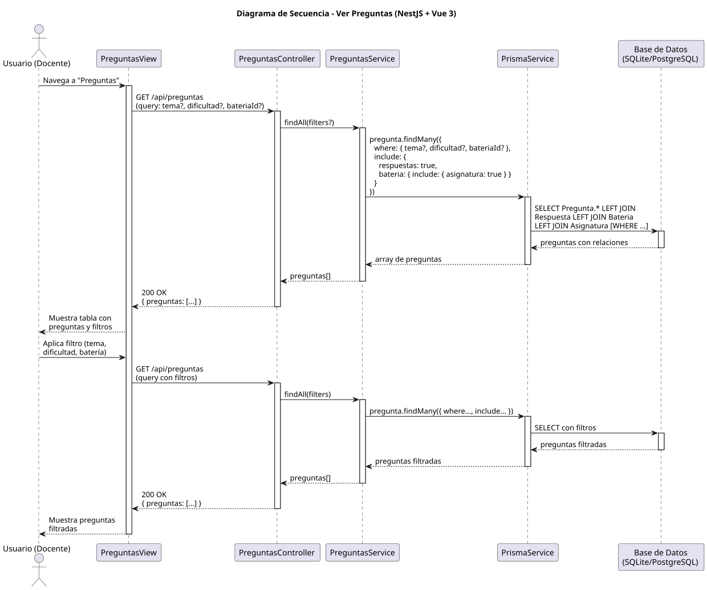

# 25-26-idsw2-sdVC > verPreguntas > Diseño

## Información del artefacto

| Campo | Valor |
|-------|-------|
| **Proyecto** | Sistema de Gestión de Exámenes Universitarios |
| **Fase RUP** | Elaboración |
| **Disciplina** | Diseño |
| **Versión** | 1.0 (NestJS + Vue 3) |
| **Fecha** | 2026-06-09 |
| **Autor** | Marcos Gutierrez |

## Propósito

Detallar la interacción entre los componentes del sistema para visualizar el listado de preguntas con filtros opcionales por tema, dificultad y batería. Caso de solo lectura sin persistencia.

## Diagrama de secuencia de diseño

||
|-|
|Código fuente: [secuencia.puml](../../../modelosUML/diseño/verPreguntas/secuencia.puml)|

## Participantes

| Componente | Responsabilidad |
|---|---|
| **PreguntasView** | Vista que muestra tabla de preguntas con filtros por tema, dificultad y batería. |
| **PreguntasController** | Endpoint `GET /api/preguntas` con query params opcionales. |
| **PreguntasService** | Método `findAll()` que aplica filtros opcionales e incluye relaciones. |
| **PrismaService** | Capa ORM que ejecuta consultas con LEFT JOINs y WHERE condicional. |
| **Base de Datos (SQLite/PostgreSQL)** | Almacena preguntas, respuestas, baterías y asignaturas. |

## Decisiones de diseño

| Decisión | Justificación |
|---|---|
| **Filtros opcionales via query params** | Los filtros (tema, dificultad, bateriaId) son opcionales y se pasan como query string. |
| **Include anidado** | Se incluyen `respuestas` y `bateria { asignatura }` en una sola consulta evitando N+1. |
| **Sin paginación** | La implementación actual no pagina; se asume volumen manejable. Se añadiría si fuera necesario. |
| **Auto-loop de filtrado** | El usuario puede aplicar filtros múltiples veces sin recargar la página (SPA). |
| **Sin persistencia** | Caso de solo lectura — no hay POST, PATCH ni DELETE. |
| **Seguridad por capas** | Solo `DOCENTE` o `ADMIN` pueden ver preguntas. |
| **Respuesta completa** | Cada pregunta incluye sus respuestas y batería con asignatura. |
| **DataTable de PrimeVue** | La vista usa PrimeVue DataTable con filtros en frontend y backend. |
