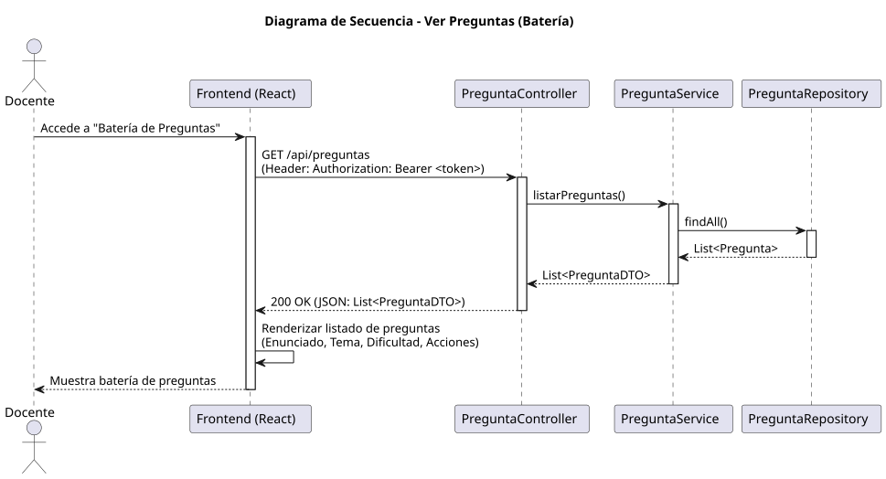

# Jorgestor > verPreguntas > Diseño

> |[🏠️](/documents/diseño/README.md)|[📊](../../../archivosEsenciales/casos-de-uso/diagramasDeContexto/diagramaDeContextoDocente/diagramaContexto.svg)|[Análisis](/documents/analisis/verPreguntas/README.md)|**Diseño**|Desarrollo|Pruebas|
> |-|-|-|-|-|-|

## Información del artefacto

- **Proyecto**: Jorgestor - Sistema de Gestión de Exámenes
- **Fase RUP**: Elaboración
- **Disciplina**: Diseño
- **Versión**: 1.0
- **Fecha**: 2026-05-31
- **Autor**: Gemini CLI

## Propósito

Detallar la implementación técnica de la visualización de la batería de preguntas para el Docente. Este diseño permite al docente navegar por el catálogo de preguntas disponibles, filtrarlas y acceder a operaciones de gestión.

## Diagrama de secuencia de diseño

||
|-|
|[Código PlantUML](../../../modelosUML/diseño/verPreguntas/secuencia.puml)|

## Participantes

- **Frontend (React)**: Componente `PreguntaList.tsx` que consume el endpoint `/api/preguntas`.
- **PreguntaController**: Endpoint `GET /api/preguntas` protegido por `@PreAuthorize("hasRole('DOCENTE')")`.
- **PreguntaService**: Lógica de negocio para recuperar y transformar las preguntas en DTOs.
- **PreguntaRepository**: Interface JPA para la persistencia de la entidad `Pregunta`.
- **PreguntaDTO**: Objeto de transferencia para los datos de la pregunta (`id`, `enunciado`, `tema`, `dificultad`).

## Decisiones de diseño

- **Entidad Pregunta**: Se implementará la entidad `Pregunta` con soporte para enums de `Tema` y `Dificultad` según el diagrama de entidad.
- **Seguridad**: Solo accesible para usuarios con rol docente.
- **Flexibilidad**: El diseño permite tanto la carga global de la batería como la carga contextual (por asignatura) en fases posteriores.
